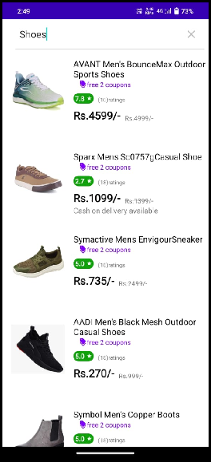

# 🛍️ E-Commerce Shoes Application    [`Application Demo`](https://drive.google.com/file/d/1BnAhJLxIfCXUPK35GdyWMuYsdXRgiT1-/view?usp=sharing)

An innovative **Android-based E-Commerce Shoes App**. This project earned us the **First Prize** 🏆 at the **Startup Competition** held at *Anantrao Pawar College of Engineering and Research, Pune*, along with a **cash prize of ₹10,000** 🎉.

## 🚀 Project Overview

Our app offers a seamless online shopping experience for footwear enthusiasts. With secure OTP verification for **cash-on-delivery** orders and smooth digital transactions through **Razorpay**, it aims to blend convenience and security in one smart platform.

This project showcases my ability to deliver a full-fledged Android application with complete backend support and payment integration.

---

## 🛠️ Technologies Used

| Layer            | Technology                     |
|------------------|--------------------------------|
| Frontend         | Android Studio (Java & XML)    |
| Backend          | Firebase (Realtime Database)   |
| Payment Gateway  | Razorpay API                   |
| OTP Verification | Fast2SMS API                   |

---

## 📌 Key Features

- 👟 Browse and shop a curated selection of shoes  
- 🔐 OTP Verification for secure cash-on-delivery orders  
- 💳 Seamless digital payments via Razorpay  
- ☁️ Real-time data management with Firebase  
- 🧾 Order confirmation and tracking  

---

## 🏆 Achievements

- 🥇 **First Prize** in Startup Competition  
- 🎓 Successfully presented as final year diploma project  
- 💸 Awarded ₹10,000 cash prize for innovation  

---

## 📷 Screenshots



## 📦 Installation

1. Clone the repository:
   ```bash
   git clone https://github.com/your-username/ecommerce-shoes-app.git
    ```

## 📬 Contact
For inquiries or collaboration:

Sushil Rahatole - [LinkedIn] (http://www.linkedin.com/in/sushil-rahatole-347182263)